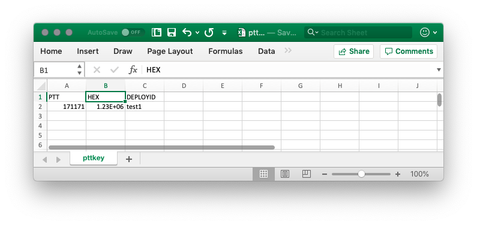
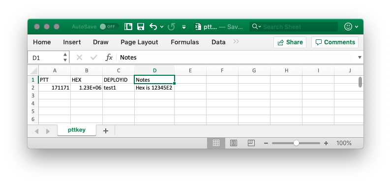

# parsegonio
[](https://zenodo.org/badge/latestdoi/122348759)

* A hack to parse the [Argos Goniometer](https://www.clsamerica.com/argos-goniometer) log data into a `prv` file readable by Argos Message Decoder / DAP Processor or WC portal.

* **warning:** No error handling! Further testing required! Use with caution. This is still under active dev and may change without backwards compatibility. 

* Ultimately, I hope a version of this will be included in the [sattagutils](https://github.com/williamcioffi/sattagutils) package.

* see below for a quick guide.

* Report any bugs or questions to the [issues](https://github.com/williamcioffi/parsegonio/issues) page. 

* If you're interested in contributing, start by taking a peak at the [guidelines](CONTRIBUTING.md).

* For now, please cite as:

Cioffi WR (2020). parsegonio: parse Argos Goniometer log data and convert into prv. R code version 0.1.0. https://github.com/williamcioffi/parsegonio. (doi:10.5281/zenodo.3647696).

## Quick start

Take a look at `testparsegonio.R `which includes a full working example to output a `prv` file.

## Details

We use the Goniometer in hyperterminal mode connected to a laptop and generating plain text log files. There is a formatted output for "favorite" platforms which you get when you click save messages, but since there is a 16 platform limit I prefer to use the hyperterimal logs as `parsegonio` input. See [below](#creating-a-prv-from-the-exported-messages-of-a-favorite-platform) for instructions on using the \*.xls output of saved messages.

Goniometer log output usually looks something like this:

```
2017-05-02 14:42:07 : USB Connection to RXG134
2017-05-10 21:00:38 Received : $NPRF,7,17,5,10,21,0,24,0A1FBD4,401677726,7,109,115,-128,-128,-4486401,2133099,10,192,D4049D095018019931F7F4B00960508485440003B6567FC0*46
2017-05-10 21:00:58 Received : $NPRF,7,17,5,10,21,0,44,0A1FBD4,401677737,7,117,113,-127,-127,-4486412,2133177,2,192,D4040555502CF64C3207F4A009605084854000027FC00000*01
```

The $NPRF indicates that a platform has been favorited, but the log will also display messages from non favorited platforms with the label $NPR. The date, PTT, signal strength, bearing, among other things are recorded here. The last field is the data message.

You can use `parsegonio` to create a simulated prv file that DAP processor can read:

```r
gfile <- "gonio_ex_log.txt"
pttkey_file <- "pttkey.csv"

source("parsegonio.r")
output <- parsegonio(gfile, pttkey_file)
cat(output, file = "gonio_output.prv")
```

`parsegonio` takes two parameters: 
- `pttkey_file` is a `csv` which includes the PTT, hex, and DeployID of platforms of interest (only the PTT and hex are necessary)
- `gfile`, in this case an example Goniometer log included in this repo.

I’ve saved the output to `gonio_output.prv` here. It seems like there is some flexibility in the `prv` format and I’ve taken some liberties, mainly because I don’t entirely understand every part of the format. In my simulated `prv`, for each platform, all the messages from the Goniometer log are lumped under one satellite pass even if they occurred over many days. This isn’t realistic, but DAP Processor doesn’t seem to mind and satellite passes don’t mean anything in this use case anyway. In addition, real `prv` files include the Doppler Argos position. Obviously I don’t have one, so I just added a point near our field site. You can change add your own positions as strings with three decimal placers using the parameters `lon` and `lat`. The format appears to be 0-360 instead of -180 to +180 by the way. There is some more chitchat about all of this in [issue #4](https://github.com/williamcioffi/parsegonio/issues/4).

Once you have the simulated prv output you can just drag it into DAP processor. It helps to have preloaded a workspace with wch files as well as DAP will use the tag settings during decoding, though you can still get something even without them.


`csv` files of various datastreams can now be exported. Some of these for instance, `*-Locations.csv`, `*-Argos.csv` will be complete junk. Others will mostly make sense, but be sure to ignore anything to do with Doppler positions or satellite passes.

## One word of caution about ptts and csvs

If you are opening any `csv` files in excel and if your hex has an E somewhere in the middle and all the other digits are numbers (not letters) then excel will interpret it as scientific notation. For example `12345E2` will be converted into `12345 x 10^2` by excel. This is quite annoying and will happen every time you open the file. It’ll look something like this:



The best solution is don’t use excel because it is a terrible `csv` editor. But many folks are most comfortable with editing `csv` files in excel so in the past I’ve added a notes column that starts with text so the real hex can be recovered if someone accidentally edits it in excel and saves the result.



## Creating a prv from the exported messages of a favorite platform
I've included an example file `favorite_ptt_180754.xls` obtained by using the save messages option for a favorited platform. To create a `prv` file, first simply save it as a csv. The expected date format is `%d-%m-%y %H:%M:%S` (this is currently hardcoded around line 186 if you have to change it). After saving a csv file you can simply run something like this and decode the prv as explained above:

```r
gfile <- "favorite_ptt_180754.csv"
ptt <- "180754"

source("parsegonio.r")
output <- parsegonio_favorite_messages(gfile, ptt)
cat(output, file = "gonio_favorite_output.prv")
```
